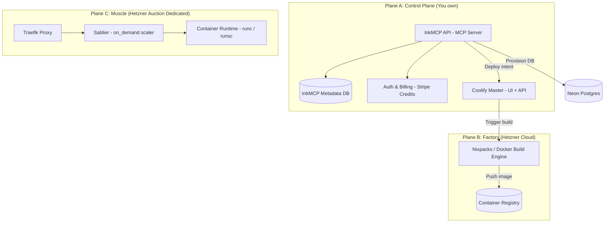

# Deploy MCP

> **One MCP to deploy them all.** Infrastructure for the agentic era.

---

## Motivation

AI agents can now write complete applications. Claude Code, Cursor, and Windsurf generate production-ready code in minutes. But when it's time to deploy, agents hit a wall:

**The Fragmentation Problem:**

- Need Railway MCP for hosting
- Need Neon MCP for database
- Need separate tools for secrets, DNS, SSL
- Manual wiring of connection strings
- Human must create accounts on each platform

**The Result:** Agents build in seconds, but deploying takes hours of human intervention.

```
# Today
Agent: "I've created your SaaS app. Here's the code."
Human: *creates Railway account*
Human: *creates Neon account*
Human: *deploys app manually*
Human: *provisions database*
Human: *copies connection string*
Human: *sets environment variables*
Human: *configures domain*
Human: *waits for SSL*
→ 2 hours later: "It's live"

# With Deploy MCP
Agent: create_app(repo="my-saas", host="mlink", name="my-saas", branch="main")
→ 60 seconds later: "https://my-saas.s1.ml.ink is live"
```

---

## Vision

**"Internet for Agents"** — Infrastructure that agents can provision autonomously.

Deploy MCP is a **platform**, not just a tool:

- Users authenticate to **us**
- We provision infrastructure using **our** provider credentials
- Agents deploy with **one command**
- Users never touch provider dashboards

---

## Core Principles

| Principle                | Description                                        |
| ------------------------ | -------------------------------------------------- |
| **Repo as Identity**     | `github.com/user/app` is the natural project key   |
| **One Transaction**      | App + database + secrets + domain in a single call |
| **Auto-Deploy Default**  | Push to GitHub → automatic deployment              |
| **Platform Abstraction** | Users never see underlying providers               |
| **Right Tool for Job**   | Frontend → edge, Backend → containers              |

---

## Authentication

Deploy MCP uses a two-part authentication system:

1. **GitHub OAuth** — For user identity and session management
2. **GitHub App** — For repository access (clone, webhooks, push tokens)

### Why Two Systems?

| Concern | GitHub OAuth | GitHub App |
|---------|--------------|------------|
| User identity | ✅ Primary purpose | ❌ Not designed for this |
| Clone/push to repos | ❌ Requires broad `repo` scope | ✅ Fine-grained per-repo access |
| Create new repos | ✅ With `repo` scope (current impl) | ✅ With GitHub App user access tokens (requires App “Administration: write”) |
| Webhook delivery | ❌ Not supported | ✅ Built-in |
| Installation tokens | ❌ Not available | ✅ Short-lived, scoped tokens |

**Summary:** GitHub App handles day-to-day repository operations (clone, push, webhooks). Today, this codebase uses GitHub OAuth `repo` scope to create new repositories, but GitHub’s REST API also supports creating repos using **GitHub App user access tokens** (user-to-server flow) if the App has the right permissions.

### Authentication Flow

```
┌─────────────────────────────────────────────────────────────────────────────┐
│                         USER ONBOARDING FLOW                                │
└─────────────────────────────────────────────────────────────────────────────┘

1. SIGN IN (GitHub OAuth)
   ┌──────────┐     ┌──────────┐     ┌──────────┐     ┌──────────┐
   │  User    │────▶│  ml.ink  │────▶│  GitHub  │────▶│  ml.ink  │
   │  clicks  │     │ /auth/   │     │  OAuth   │     │ callback │
   │ "Sign in"│     │ github   │     │  consent │     │          │
   └──────────┘     └──────────┘     └──────────┘     └──────────┘
                                                            │
                                                            ▼
                                                    ┌──────────────┐
                                                    │ Create user  │
                                                    │ Store OAuth  │
                                                    │ token (enc)  │
                                                    │ Set session  │
                                                    └──────────────┘

2. INSTALL GITHUB APP (Repository Access)
   ┌──────────┐     ┌──────────┐     ┌──────────┐     ┌──────────┐
   │  User    │────▶│  GitHub  │────▶│  User    │────▶│  ml.ink  │
   │  clicks  │     │  App     │     │ selects  │     │ /auth/   │
   │"Install" │     │  install │     │  repos   │     │ githubapp│
   └──────────┘     └──────────┘     └──────────┘     │ callback │
                                                       └──────────┘
                                                            │
                                                            ▼
                                                    ┌──────────────┐
                                                    │ Store        │
                                                    │ installation │
                                                    │ ID           │
                                                    │              │
                                                    │ Create       │
                                                    │ Coolify      │
                                                    │ source       │
                                                    └──────────────┘

3. (OPTIONAL) GRANT REPO SCOPE (for create_github_repo tool)
   ┌──────────┐     ┌──────────┐     ┌──────────┐     ┌──────────┐
   │  User    │────▶│  ml.ink  │────▶│  GitHub  │────▶│  ml.ink  │
   │  clicks  │     │ /auth/   │     │  OAuth   │     │ callback │
   │ "Grant"  │     │ github   │     │  +repo   │     │          │
   └──────────┘     │ ?scope=  │     │  scope   │     └──────────┘
                    │ repo     │     └──────────┘          │
                    └──────────┘                           ▼
                                                    ┌──────────────┐
                                                    │ Update OAuth │
                                                    │ token with   │
                                                    │ repo scope   │
                                                    │              │
                                                    │ Downgrade    │
                                                    │ protection:  │
                                                    │ keeps repo   │
                                                    │ scope on     │
                                                    │ re-login     │
                                                    └──────────────┘

4. GENERATE API KEY (for MCP/CLI)
   ┌──────────┐     ┌──────────┐
   │  User    │────▶│  ml.ink  │────▶ API Key: dk_live_abc123...
   │ dashboard│     │ /settings│
   └──────────┘     └──────────┘
```

> **Note:** Step 3 is optional. The `repo` scope allows agents to create new GitHub repositories via the `create_github_repo` tool. Without it, agents can only deploy to existing repositories. The system implements "downgrade protection" — if a user later signs in without the repo scope, their existing repo-scoped token is preserved if still valid.

### API Key Authentication (MCP)

Agents authenticate via API key in the `Authorization` header:

```
Authorization: Bearer dk_live_abc123...
```

API keys are:
- Generated per-user from the dashboard
- Hashed with bcrypt (only prefix stored for lookup)
- Validated on every MCP request

### GitHub App Webhooks

The GitHub App receives webhooks for:

| Event | Action |
|-------|--------|
| `push` | Triggers auto-redeploy for matching apps |
| `installation.created` | Stores installation ID, creates Coolify source |
| `installation.deleted` | Clears installation ID |

Webhooks are verified using HMAC-SHA256 with the configured webhook secret.

---

## Tech Stack

- **Language**: Go
- **MCP Framework**: [mcp-go](https://github.com/modelcontextprotocol/go-sdk)
- **Database**: Postgres (with sqlc)
- **Auth**: GitHub OAuth + GitHub App + JWT sessions
- **Orchestration**: Temporal (deployment workflows)
- **Deployment Backend**: Coolify
- **Compute**: Hetzner (dedicated + cloud)
- **Database Provisioning**: Turso (SQLite)

---

## MCP Tools

| Tool | Description | Requirements |
|------|-------------|--------------|
| `whoami` | Get current user info and GitHub App status | API key |
| `create_app` | Deploy an app from a GitHub repository | GitHub App installed |
| `list_apps` | List all deployed apps | API key |
| `get_app_details` | Get app details including logs | API key |
| `redeploy` | Trigger a redeploy of an existing app | GitHub App installed |
| `delete_app` | Delete an app | API key |
| `create_resource` | Provision a database (SQLite via Turso) | API key |
| `list_resources` | List all provisioned resources | API key |
| `get_resource_details` | Get resource connection details | API key |
| `delete_resource` | Delete a resource | API key |
| `create_github_repo` | Create a new GitHub repository | `repo` OAuth scope |
| `get_github_push_token` | Get a temporary token to push to a repository | GitHub App installed |

### Adding MCP Server to Claude Code

```bash
# Production
claude mcp add --transport http mcpdeploy https://api.ml.ink/mcp --header "Authorization: Bearer <your-api-key>"

# Local development
claude mcp add --transport http mcpdeploy http://localhost:8081/mcp --header "Authorization: Bearer <your-api-key>"
```

---

## Deployment Workflow

When an agent calls `create_app`, the following happens:

```
┌─────────────────────────────────────────────────────────────────────────────┐
│                           DEPLOYMENT FLOW                                    │
└─────────────────────────────────────────────────────────────────────────────┘

1. AGENT CALLS create_app
   ┌──────────┐     ┌──────────┐     ┌──────────┐
   │  Agent   │────▶│   MCP    │────▶│ Temporal │
   │  (via    │     │  Server  │     │ Workflow │
   │  Claude) │     │          │     │  Start   │
   └──────────┘     └──────────┘     └──────────┘

2. TEMPORAL WORKFLOW EXECUTES
   ┌──────────┐     ┌──────────┐     ┌──────────┐     ┌──────────┐
   │ Create   │────▶│ Create   │────▶│ Start    │────▶│ Wait for │
   │ App in   │     │ Coolify  │     │ Deploy   │     │ Build    │
   │ Postgres │     │ App      │     │          │     │ Complete │
   └──────────┘     └──────────┘     └──────────┘     └──────────┘
                          │
                          ▼
                    Uses GitHub App
                    installation token
                    to clone repo

3. BUILD & DEPLOY (Coolify)
   ┌──────────┐     ┌──────────┐     ┌──────────┐     ┌──────────┐
   │ Clone    │────▶│ Build    │────▶│ Push     │────▶│ Deploy   │
   │ Repo     │     │ (Nix-    │     │ Image    │     │ to       │
   │          │     │ packs)   │     │          │     │ Muscle   │
   └──────────┘     └──────────┘     └──────────┘     └──────────┘

4. AUTO-REDEPLOY (Push to GitHub)
   ┌──────────┐     ┌──────────┐     ┌──────────┐     ┌──────────┐
   │ Git Push │────▶│ GitHub   │────▶│ Webhook  │────▶│ Temporal │
   │          │     │ Webhook  │     │ Handler  │     │ Redeploy │
   └──────────┘     └──────────┘     └──────────┘     │ Workflow │
                                                       └──────────┘
```

### Workflow Idempotency

GitHub webhook delivery is at-least-once, so the same push event may be delivered multiple times. The deployment service handles this by:

1. Deriving a deterministic workflow ID from the commit SHA
2. Using Temporal's `REJECT_DUPLICATE` policy
3. Logging and returning success if a workflow for that commit is already running

---

# Architecture

Deploy MCP uses a 3-plane architecture separating control, build, and run concerns.

## Core Philosophy

1. **Abstraction**
   - Agents interact with **Projects** and **Apps** (intent), not "servers" or "containers" (implementation)
   - The MCP surface is stable; providers are replaceable

2. **Safety**
   - User code runs with strong guardrails
   - **gVisor** sandboxes protect against kernel exploits (implemented via custom Coolify fork)
   - Egress firewall rules block metadata endpoints, SMTP, mining pools

3. **Workflow Orchestration**
   - Deployments run as Temporal workflows for reliability
   - Automatic retries, idempotency, and observability built-in

---

## Build Packs

Deploy MCP supports multiple build strategies:

| Build Pack | Use Case |
|------------|----------|
| `nixpacks` | Auto-detect language and build (default) |
| `dockerfile` | Custom Dockerfile |
| `static` | Static files served by Caddy |
| `dockercompose` | Multi-container apps |

---

## What Gets Deployed

### Service Types

- **Web apps** — Next.js, Remix, SvelteKit, etc. (SSR or static)
- **APIs** — Express, FastAPI, Go servers
- **Backends** — WebSocket servers, workers, cron jobs

### Database Resources

- **SQLite** — Via Turso (managed, replicated SQLite)

---

## Physical Architecture (3-plane)

We separate control, build, and run so CPU-heavy builds never lag a live game.

### Topology



### What runs where (explicit)

**Plane A — Control Plane**

- InkMCP API
- InkMCP metadata DB (projects/resources/usage/audit)
- Auth + billing + credits ledger
- Scheduler / placement logic (when multiple run nodes exist)

**Plane B — Factory**

- Coolify "master" instance (UI + API) orchestrating deployments via SSH to other servers
  Coolify uses **SSH** for deployments and management. ([Coolify][1])
- Build engine (Nixpacks / Dockerfile / Compose build packs) ([Coolify][2])
- Container registry (shared image store; required once you have multiple run servers/build servers) ([Coolify][3])

**Plane C — Muscle**

- Docker engine + proxy on each run server
- User containers (apps, backends, workers)
- On-demand scaling middleware (Sablier) for `on_demand` services
- Optional sandbox runtime (`runsc` / gVisor target)

> Coolify design note: each server runs its **own proxy**, and app traffic goes directly to the server hosting that app (not through the main Coolify server). DNS must point to the correct server. ([Coolify][4])

---

## Runtime Modes: Technical Behavior

### `static`

- Build output served by a lightweight web server container
- Very low CPU/RAM
- Best for docs, SPAs, landing pages

### `on_demand`

- Requests hit **Traefik → Sablier**
- Service sleeps after idle window
- Wakes on request (cold start ~seconds)
- Best for "mostly idle" Next.js SSR, admin panels, internal tools

### `persistent`

- Always-on container (reserved RAM/CPU)
- No sleeping
- Best for WebSocket games, chat, bots, workers, realtime APIs

---

## MCP Interface (The Agent Contract)

### Principles

- **Name-based** — Agents reference apps by name, not IDs
- **Discoverable** — `list_*`, `get_*` tools for exploration
- **Logs are first-class** — Agents can self-debug via `get_app_details`

### Implemented Tools

#### Apps
```
create_app(repo, host?, branch, name, project?, build_pack?, port?, env_vars?)
list_apps()
get_app_details(name, project?, include_env?, runtime_log_lines?, deploy_log_lines?)
redeploy(name, project?)
delete_app(name, project?)
```

#### Resources (Databases)
```
create_resource(name, type?, size?, region?)
list_resources()
get_resource_details(name)
delete_resource(name)
```

#### GitHub Integration
```
create_github_repo(name, description?, private?)
get_github_push_token(repo)
```

#### Identity
```
whoami()
```

---

## Databases

### Current Implementation

**SQLite via Turso** — Managed, replicated SQLite databases.

```
create_resource(name="my-db", type="sqlite", region="eu-west")
```

Returns:
- `url` — libSQL connection URL
- `auth_token` — Authentication token (encrypted at rest)

### Future Options

- **Postgres** — Via Neon or self-hosted
- **Redis/KV** — Via Upstash for caching/queues
- **Bring-your-own** — Connection string passthrough

---

## Container Registry & Artifact Storage

Once you have:

- multiple run servers, and/or
- a dedicated build server

…you need a shared registry so run servers can pull the built images. Coolify's build server flow explicitly assumes images are pushed to a registry. ([Coolify][3])

### Recommended approach

- Use a registry with durable storage (local NVMe + backups, or object-storage-backed registry).
- Avoid relying on flaky network mounts for hot-path registry storage.

> Note: "Storage Box mounted via CIFS" can work for backups/archives, but CIFS mounts are commonly reported as brittle for container hot paths (stale mounts, permissions, disconnects). Treat it as **backup storage**, not a live registry datastore.

### Registry via Coolify API

When deploying via API, specify the registry image directly:

```json
{
  "docker_registry_image_name": "ghcr.io/user/app:latest"
}
```

Coolify can pull from any registry configured in its settings (Docker Hub, GHCR, custom registries).

---

## Ops Manual

### Connecting Auction (Dedicated) servers to Cloud (Factory) via vSwitch

Dedicated auction servers and cloud servers sit on different networks. Hetzner supports bridging them using a Robot vSwitch connected to a Cloud Network subnet. ([Hetzner Docs][5])

High-level steps:

1. In Hetzner Cloud Console: create a Network (e.g. `ink-vpc`, `10.0.0.0/16`)
2. Add a subnet and enable "Dedicated server vSwitch connection" (select your Robot vSwitch) ([Hetzner Docs][5])
3. In Robot: create/configure vSwitch and attach dedicated servers ([Hetzner Docs][6])
4. On the dedicated server OS: configure VLAN/Netplan for that vSwitch VLAN, assign a private IP
5. In Coolify: add the server via its private IP as a deployment destination

### Adding multiple Hetzner machines to Coolify

- Coolify manages remote servers via SSH ([Coolify][1])
- Each run server hosts its own proxy and serves traffic directly ([Coolify][4])
- InkMCP must implement placement logic (which server to deploy to)

DNS strategy (simplest):

- `*.s1.apps.example.com` → run server #1
- `*.s2.apps.example.com` → run server #2
  InkMCP returns the correct hostname base depending on placement.

---

## Backups & Restore

### What we back up (by category)

1. **InkMCP State (critical)**

   - metadata DB (projects/resources/usage/audit)
   - credits ledger + billing webhook state
   - encryption keys/secrets

2. **Coolify State (critical)**

   - Coolify configuration + metadata
   - Use Coolify's S3-compatible backup feature ([Coolify][7])

3. **User Data (critical)**

   - Databases: provider-native backups (Neon), and/or scheduled dumps
   - Persistent volumes: only if explicitly supported; define policy

4. **Images (important but rebuildable)**
   - images should be treated as cache/artifacts, not the source of truth

### Restore procedure (disaster recovery)

**Scenario: Factory (Coolify master) lost**

1. Provision a fresh Factory server
2. Install Coolify
3. Restore from S3 backup (Coolify supports backup/restore workflows) ([Coolify][7])
4. Reconnect run servers (if not automatically restored)
5. Validate proxies/DNS

**Downtime reality check**

- Existing apps on run servers can continue serving traffic because each run server has its own proxy and traffic does not depend on the master. ([Coolify][4])
- You _do_ lose management/deploy capability until restore.

---

## Security Configuration

### Coolify Native Resource Limits

Coolify supports container resource limits via API:

| Setting               | Coolify Field               | Example                           |
| --------------------- | --------------------------- | --------------------------------- |
| Memory limit          | `limits_memory`             | `512m`                            |
| Memory + swap         | `limits_memory_swap`        | `512m`                            |
| CPU limit             | `limits_cpus`               | `0.5`                             |
| CPU pinning           | `limits_cpuset`             | `0,1`                             |
| Custom Docker options | `custom_docker_run_options` | `--cap-drop=ALL --pids-limit=256` |

### Host-Level Hardening

See `infra/hetzner/hardening/` for complete setup scripts including:

- Egress restrictions (iptables rules for metadata service, SMTP)
- gVisor integration (`runsc` runtime)
- Least-privilege container policies

---

## Coolify API Integration

InkMCP deploys applications via Coolify's REST API.

### Authentication

All API requests require a Bearer token (Laravel Sanctum):

```
Authorization: Bearer <coolify-api-token>
```

### Key Endpoints

| Endpoint                           | Method | Purpose                     |
| ---------------------------------- | ------ | --------------------------- |
| `/api/v1/applications/dockerimage` | POST   | Deploy from Docker image    |
| `/api/v1/applications/public`      | POST   | Deploy from public Git repo |
| `/api/v1/applications/{uuid}`      | PATCH  | Update application settings |
| `/api/v1/deploy`                   | POST   | Trigger deployment          |

### Deploying an Application

```bash
curl -X POST https://coolify.example.com/api/v1/applications/dockerimage \
  -H "Authorization: Bearer $COOLIFY_TOKEN" \
  -H "Content-Type: application/json" \
  -d '{
    "project_uuid": "abc123",
    "server_uuid": "def456",
    "environment_name": "production",
    "docker_registry_image_name": "ghcr.io/user/app:latest",
    "ports_exposes": "3000",
    "limits_memory": "512m",
    "limits_cpus": "0.5",
    "custom_docker_run_options": "--cap-drop=ALL --pids-limit=256 --runtime=runsc",
    "instant_deploy": true
  }'
```

### Persistent Storage

Coolify supports two volume types:

- **LocalPersistentVolume** - Docker named volume or host path bind mount
- **LocalFileVolume** - Embed file content (for configs)

For disk-backed user storage:

```json
{
  "name": "user-data",
  "mount_path": "/data",
  "host_path": "/mnt/persistent/{project-id}"
}
```

Host path volumes require cleanup when project is deleted (Coolify handles named volumes automatically).

---

## Non-goals (for sanity)

- Replacing GitHub (we integrate via GitHub App)
- Building a full PaaS UI for users (MCP is the interface; Coolify is the backend)
- Solving arbitrary sandboxing perfectly on day 1 (ship baseline + iterate)

---

## Design Notes

### 3-Plane Architecture
The separation of control, build, and run planes matches Coolify's recommendation that builds can make servers unresponsive if mixed with runtime workloads.

### gVisor Integration
gVisor is **implemented** via a custom Coolify fork that adds `--runtime` support to Custom Docker Run Options:
- **Fork:** https://github.com/gluonfield/coolify/tree/feature/add-runtime-option
- **PR:** https://github.com/coollabsio/coolify/pull/8113
- Uses `hostinet` mode for DNS compatibility with Docker networks

See `infra/hetzner/hardening/` for complete setup documentation.

### Temporal Workflows
All deployments run as Temporal workflows, providing:
- Automatic retries on transient failures
- Idempotency for webhook-triggered deploys
- Visibility into deployment progress
- Clean separation of orchestration from business logic

---

## References

[1]: https://coolify.io/docs/knowledge-base/server/openssh "OpenSSH | Coolify Docs"
[2]: https://coolify.io/docs/applications/build-packs/overview "Build Packs | Coolify Docs"
[3]: https://coolify.io/docs/knowledge-base/server/build-server "Build Server | Coolify Docs"
[4]: https://coolify.io/docs/knowledge-base/server/introduction "Introduction | Coolify Docs"
[5]: https://docs.hetzner.com/networking/networks/connect-dedi-vswitch/ "Connect Dedicated Servers (vSwitch)"
[6]: https://docs.hetzner.com/robot/dedicated-server/network/vswitch/ "vSwitch"
[7]: https://coolify.io/docs/knowledge-base/how-to/backup-restore-coolify "Backup and Restore Your Coolify Instance"
[8]: https://gvisor.dev/docs/ "What is gVisor?"
[9]: https://coolify.io/docs/knowledge-base/docker/custom-commands "Custom Commands | Coolify Docs"
